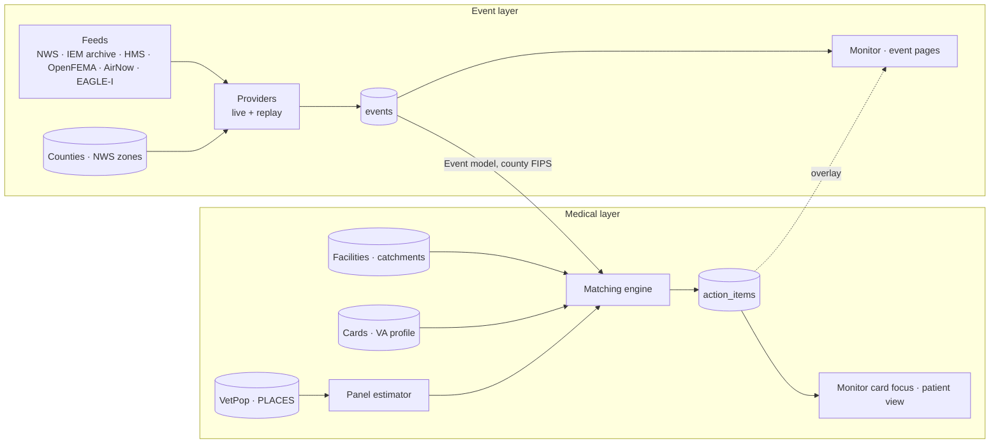

# Design and user guide

*As of 2026-09-23.*

This guide explains how the system is built and how to use it. It describes the code as it
is today. The planning documents it grew from are `docs/requirements.md` (what the system
should become) and `docs/implementation-plan.md` (the M0–M5 milestones).

The system has two layers that will be separated further, and each has its own document:

| Document | Covers |
| --- | --- |
| [events-and-playback.md](events-and-playback.md) | **Event layer.** Pulls weather and environmental feeds, normalizes them into one event model, resolves them to counties, stores them, and plays them back on a map. It knows nothing about medicine. |
| [medical-layer.md](medical-layer.md) | **Medical layer.** Holds the VA facilities, their catchments and estimated patient panels, and the eight clinical playbook cards. It matches events to cards and turns each match into action items for care teams and patients. |
| [data-sources.md](data-sources.md) | Every external source: what it provides, how it is fetched and cached, which layer uses it, and its known gaps. |
| [user-interface.md](user-interface.md) | **The web interface**, page by page: how to use each screen and the rule behind what it shows (ranking, badges, colours, provenance, playback controls), plus known UI issues. |

## The system in one paragraph

An event feed reports that something is happening in a set of counties: a heat warning, a
hurricane watch, a smoke plume. The VA facilities that own a patient panel in those counties
come into scope. Every clinical card whose trigger matches the event produces one action item
for each audience at each facility. Each item carries the card's reviewed text, and its panel
size is estimated from public aggregate data. Nothing in the system is about an individual
patient. This is **Mode A** (aggregate, no PHI), and every number carries the formula and
sources that produced it.

## Architecture



**The seam between the layers is the `Event` record** (`src/xevents/models.py`) and its
list of county FIPS codes. The engine reads events and nothing else from the event layer.
The event layer never reads cards, panels or action items, with one exception: the
Monitor overlays action items and cards on its event map (see
[events-and-playback.md §7](events-and-playback.md#7-what-couples-this-layer-to-the-medical-layer)).

**Shared foundation.** Both layers use the county geography (`fixtures/reference/counties.geojson`,
`src/xevents/geography/`), one database (`src/xevents/store.py`) and one FastAPI app
(`src/xevents/api.py`, `src/xevents/web/`).

## Quick start

Needs Python 3.12 and [uv](https://docs.astral.sh/uv/). No API key, no database server and
no network: the reference data and replay scenarios are committed.

```sh
make demo      # fresh SQLite → facilities + catchments → replay events → action items → serve
make demo SCENARIO=heat_dome_2021   # the same, but open a replay instead of the live view
```

After about a minute, `make demo` opens the live Monitor in your browser. With
`LIVE_REFRESH_MINUTES` set (it is in `.env.example`), live events arrive a minute or so after
startup; without it, the live view stays empty and the replays are the demo. Pages:

| Page | For |
| --- | --- |
| <http://localhost:8000/> | Monitor: live now (last two weeks, forecasts ahead) or a replay, on one clock — map, cards firing, facilities by acuity, outreach queue, timeline |
| <http://localhost:8000/?scenario=heat_dome_2021&facility=vha_648> | One facility's fired cards, panels and checklist, in Monitor's focus layout |
| <http://localhost:8000/replays> | Scenarios: each replay's story, stats and guided moments |
| <http://localhost:8000/card-library> | The eight playbook cards: triggers, population, actions, evidence, where each fires |
| <http://localhost:8000/sources> | Every data source: coverage, limits, last live run |
| <http://localhost:8000/dashboard/events> | Every event, with its window, geography and metrics (event layer) |
| <http://localhost:8000/demo/patient-view?facility=vha_648> | What a patient or caregiver would see (medical layer) |
| <http://localhost:8000/about> | What this is and how to use it (also the **About** pill on every page; `?about=1` opens it, `?tour=1` starts the guided tour) |
| <http://localhost:8000/docs> | Interactive API reference |

Every page states that **times are UTC**. For containers, hosting and live mode, see
[`docs/deploy.md`](../deploy.md).

### Configuration

Copy `.env.example` to `.env`, which is gitignored. Every `make` target loads it.

| Variable | Needed for | Default |
| --- | --- | --- |
| `EVENT_MODE` | `replay` or `live` for `make ingest match` | `replay` |
| `DATABASE_URL` | Postgres, or the SQLite fallback | `sqlite:///xevents.db` (`make demo` uses `demo.db`) |
| `NWS_USER_AGENT` | Live NWS pulls. NWS blocks requests without a contact string | none |
| `VA_FACILITIES_API_KEY` | Rebuilding `facilities.geojson` only (`make reference`) | none |
| `AIRNOW_API_KEY` | Optional second AirNow path (the key-based API). Live AQI comes from AirNow's keyless public files without it | none |
| `HUD_API_TOKEN` | Optional HUD ZIP↔county crosswalk. Census ZCTA is used otherwise | none |
| `EAGLEI_TOKEN` | Live EAGLE-I outages from FEMA's partner FeatureServer, which is token-gated | none |
| `EAGLEI_FEATURE_URL` | Public EAGLE-I mirror layers with the same fields, separated by spaces or commas, used instead of FEMA's. Live EAGLE-I is skipped when this and the token are both unset | the Georgia and Ohio mirrors, in `.env.example` |
| `LIVE_REFRESH_MINUTES` | The app runs live ingest + match at startup and then every N minutes; 0 or empty = off | `60` in `.env.example` and the image |
| `CACHE_SNAPSHOT` | A response-cache file baked at image build (`scripts/bake_cache.py`) and loaded at startup, so a new instance starts warm | set in the `Dockerfile` only |

**Never commit a key.** In `.env.example`, every key and token stays empty; only non-secret
defaults (the NWS contact string, the EAGLE-I mirrors, the refresh interval) have values.
`tests/test_secrets.py` fails the build if a tracked file assigns a credential-shaped value
to a secret-named variable.

### Make targets

| Target | Does |
| --- | --- |
| `make demo` | The whole replay pipeline into a fresh `demo.db`, then serves and opens the live Monitor (`SCENARIO=<id>` opens a replay) |
| `make container` | Rebuilds the demo image and replaces the `mee` container on :8000, the same image Render runs |
| `make load` | Loads reference data, attributes facilities to county and VISN, builds catchments |
| `make ingest` | Loads events (`EVENT_MODE=replay`: all scenarios; `live`: real feeds) |
| `make match` | Runs the engine over stored events and writes action items |
| `make serve` | Serves the working tree on :8000 with reload (`PORT=8001` to run beside a container; see [`docs/deploy.md`](../deploy.md) §1) |
| `make reference` | Rebuilds the cached reference data from its sources (network; facilities need a key) |
| `make scenarios` | Rebuilds the replay fixtures from their archived raw files |
| `make schema` | Regenerates `cards/card.schema.json` from the Pydantic models |
| `make lint test` | ruff, mypy --strict and pytest. Must stay green |

## Guarantees the design depends on

These come from `CLAUDE.md`, and tests enforce most of them.

1. **No PHI, no synthetic patients.** Panels are aggregate estimates with provenance.
2. **The engine is pure.** `src/xevents/engine.py` does no I/O. The same inputs always produce
   the same action items, and five golden tests pin the replay output exactly.
3. **Clinical text comes only from card YAML.** Code copies it verbatim and never
   generates, paraphrases or "improves" it.
4. **Nothing advises stopping or changing a medication.** Every medication card carries the
   templated "Don't stop your medication — contact your care team."
5. **No VA fact is hard-coded.** Prevalence, acuity order, channels and hooks live in
   `profiles/va.yaml`. Clinical content lives in `cards/*.yaml`.
6. **An empty board is never an all-clear.** Live mode shows feed freshness, and a stale feed
   is flagged.
7. **Every external call is cacheable.** Providers are the only network code, and every
   fixture can be rebuilt from its raw files.

## Where to go next

- [user-interface.md](user-interface.md): how to use Monitor, the Scenarios, Cards and
  Sources tabs, the About screen, event pages and the patient view, and how each is meant to work.
- `docs/card-reference-for-frontend.md`: API shapes and rendering rules for anyone building
  a UI on the action items.
- `docs/card-library.md`: the clinical source of truth for all eight cards.
- `docs/medical-references.md`: the reference index behind the cards — sources with
  verification status, card by card, and the cross-card consistency rules.
- `PROGRESS.md`: the dated log of what was built, what was decided, and what still needs a
  clinical reviewer.
