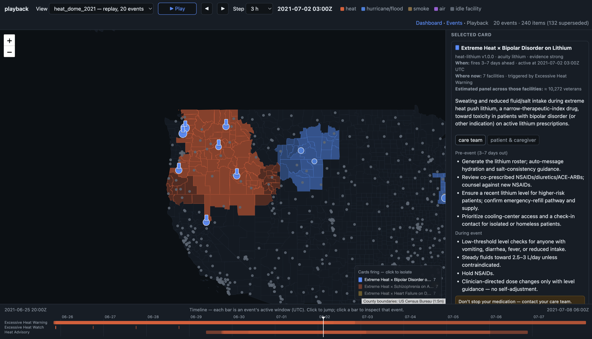

# Event layer: feeds, event store and playback

*Part of the [design and user guide](README.md). As of 2026-09-21.*

The event layer answers one question: **what hazardous weather or environmental event is
active in which US counties, and when?** It pulls public feeds, normalizes them into one
`Event` model, resolves every event to county FIPS codes, stores the result, and lets you
scrub through it on a map. It contains no clinical logic. The medical layer
([medical-layer.md](medical-layer.md)) reads the events it produces.

## 1. The event model

Every source is normalized into the same record (`src/xevents/models.py`, `Event`), which
borrows the CAP (Common Alerting Protocol) vocabulary that NWS already emits.

| Field | Meaning |
| --- | --- |
| `source`, `source_id` | `nws`, `hms`, `openfema`, `airnow` (`replay` is reserved). Together they form the natural key `event_key` = `source:source_id` |
| `event_type` | `heat`, `hurricane_flood`, `wildfire_smoke`, `air_pollution` or `power_outage` |
| `event_name` | The source's own vocabulary, e.g. `Excessive Heat Warning`, `Heavy smoke`. Card triggers match on it |
| `severity`, `urgency`, `certainty` | CAP enums. Severity (`Extreme` > `Severe` > `Moderate` > `Minor` > `Unknown`) drives map shading and supersession |
| `onset`, `expires` | The active window, stored in UTC |
| `geography` | `county_fips` (the join key), plus `ugc`, `zips`, `states`, optional GeoJSON `polygon`, `area_desc`, and a `note` on how counties were derived |
| `metrics` | Source-specific numbers: AQI, smoke density, FEMA disaster number, `retrieval` (e.g. archive) |
| `scenario` | Replay scenario id, or `null` for live events |
| `raw_ref` | Path or URL of the raw payload the event was built from |

**Semantics of "active".** An event is active at time *t* when `onset ≤ t ≤ expires`.
Replays and live data share this definition.

**County resolution is the layer's core job.** Everything downstream joins on county FIPS,
so each provider must produce counties:

| Geography in the source | Resolution | Code |
| --- | --- | --- |
| CAP `SAME` codes | Used directly as county FIPS | `providers/nws.py` |
| NWS county UGC (`SSCnnn`) | State FIPS table | `geography/nws_zones.py` |
| NWS zone UGC (`SSZnnn`) | NWS zone-county correlation file. Historical replays use **dated** zone geometry, because NWS renumbered zones after 2021 | `geography/nws_zones.py`, scenario `build.py` |
| Connecticut legacy counties (`09001–09015`) | Crosswalk to the 2022 planning regions (`09110–09190`) by area share | `fixtures/reference/ct_legacy_county_crosswalk.csv` |
| Polygon (HMS smoke, zone geometry) | Approximate: a county counts when its representative point is inside the polygon, or any polygon vertex is inside the county | `geography/polygons.py` |
| Point (AirNow monitor) | Point-in-polygon against the county boundaries | `geography/counties.py` |

The polygon rule is a deliberate simplification that avoids a PostGIS dependency. It can
miss a county that a plume clips at its edge.

## 2. Providers

A provider implements `EventProvider.fetch(window) -> list[Event]`
(`src/xevents/providers/base.py`). Providers are the only code in the repository that
touches the network, and each one caches its raw responses (`raw_dir`) so a pull can be
replayed. Details of each source are in [data-sources.md](data-sources.md).

| Provider | Produces | Used in |
| --- | --- | --- |
| `NWSAlertsProvider` | NWS watches, warnings and advisories in force now (`/alerts/active`), filtered to the product names in `NWS_EVENT_TYPES` | live |
| `IEMArchiveProvider` | The same NWS products from the Iowa State VTEC archive, for any past window | live (2-week backfill), scenario builders |
| `HMSSmokeProvider` | One event per day per smoke density (Light, Medium, Heavy) from NOAA HMS polygons | live (last 2 days), `smoke_nyc_2023` |
| `OpenFEMAProvider` | Disaster declarations grouped per disaster, typed by incident | live, `ian_2022` |
| `AirNowProvider` | Monitor observations mapped to counties as air-pollution events | live, only with `AIRNOW_API_KEY` |
| `ReplayProvider` | Reads a scenario's `events.json` | replay |

**Event types with no producer yet.** No provider emits `power_outage` events or a
`heatrisk` metric, so any card trigger that depends on them is currently dormant. Smoke and
air-pollution events are ingested and mapped, but no v1 card triggers on them.

## 3. Live and replay modes

Both modes write to the same `events` table. `scenario` distinguishes them.

**Replay** (`EVENT_MODE=replay make ingest`, the default) loads every
`fixtures/events/<scenario>/events.json`. It first deletes that scenario's rows, so a
re-ingest is idempotent. Replays are deterministic and need no network, so they are the
right default for demos and tests.

**Live** (`EVENT_MODE=live make ingest`) queries every provider for a window around now.
The providers run in this order, and a failure in one does not stop the others:

1. NWS `/alerts/active`: what is in force right now.
2. IEM archive for the trailing `--lookback-days` (default 14). `/alerts/active` alone has
   no history, so the live view would go empty whenever the weather is calm.
3. OpenFEMA declarations for the window.
4. HMS smoke for the last 2 days.
5. AirNow for the last 6 hours, if a key is set.

Because the same alert can arrive from both (1) and (2) under different ids, `dedupe()` in
`scripts/ingest.py` drops archive copies that have the same product name, counties and onset
hour, and keeps the live copy. Live rows are upserted by `event_key`, so re-running is safe.
To keep live data current, run `ingest` and `match` on a schedule, every 15–30 minutes.
[`docs/deploy.md`](../deploy.md) §4 covers this.

**Feed freshness.** `GET /feeds` reports per-source event counts and the time of the last
ingest, and marks a feed **stale** after 6 hours. Live pages show it as a banner, so an
empty map is never mistaken for an all-clear.

## 4. Replay scenarios

Each scenario lives in `fixtures/events/<scenario>/` and contains the raw archived source
files (`raw/`), a `build.py` that turns them into `events.json`, and a README with retrieval
dates and URLs. `make scenarios` rebuilds all three. `fixtures/events/README.md` lists the
known gaps.

| Scenario | Window (UTC) | Events | What it shows |
| --- | --- | --- | --- |
| `heat_dome_2021` | 2021-06-25 → 07-08 | 20 NWS heat products (watches → warnings) over 129 WA/OR/ID counties | Heat watches escalating to warnings across the Pacific Northwest |
| `ian_2022` | 2022-09-23 → 11-04 | 66 NWS tropical, surge and flood products plus FEMA DR-4673, 70 FL counties | Hurricane landfall and flooding, with the declaration as context |
| `smoke_nyc_2023` | 2023-06-06 → 06-09 | 9 HMS smoke events (3 days × 3 densities) | Canadian wildfire smoke over New York. Exercises the smoke path |

To add a scenario, create `fixtures/events/<name>/` with `raw/`, a `build.py` that uses the
archive and HMS providers (see `_common.py`) and writes `events.json` with
`scenario="<name>"`, and a README with provenance. `list_scenarios()` finds it automatically.

## 5. Using the playback view

`/playback` is the layer's main screen: a US map, a side panel and a timeline, all driven by
one time cursor *t*.

*The `heat_dome_2021` replay at 2021-07-02 03:00Z, the peak of the Excessive Heat
Warnings. Heat-shaded counties cover WA and OR. The card legend at the lower right has
isolated Card 1 (heat × lithium). Its chips mark the 7 stations where it fires, and the side
panel shows the card's care-team text and safety line. The timeline at the bottom has one
lane per NWS product, and the playhead is at t.*

**Choosing what to watch.** Use the **View** selector to pick a replay scenario, or
**live (now) — last 2 weeks**. The URL parameter `?scenario=` selects it directly, and the
Dashboard and Events links in the header keep the same view.

**Moving through time.**

| Control | Effect |
| --- | --- |
| ▶ Play / Pause, or **Space** | Advances *t* by one step per tick |
| ◀ ▶ buttons, or **← →** | Pauses and steps back or forward |
| **Step** selector | Step size: 1 h, 3 h (default), 6 h, 12 h or 1 day |
| Click or drag on the timeline | Seeks to that moment |
| Click an event bar | Selects that event |

**Reading the map.**

- **Counties** are shaded by the most severe event type active at *t*: heat, hurricane or
  flood, wildfire smoke, air pollution, or power outage. The shade deepens with CAP
  severity. The legend shows each type with its live county count. The basemap is drawn
  from the app's own county boundaries, so there are no tile servers and no key, and the map
  works offline.
- **Facilities** (circles) and **card chips** (small fanned stacks above a facility) come
  from the medical layer's overlay. They are described in
  [medical-layer.md §6](medical-layer.md#6-using-the-care-team-pages).

**Reading the timeline.** The timeline has one lane per event type and one bar per event
across its active window, with day gridlines and a playhead at *t*.

**The side panel** shows, at *t*: **Events now**, plus the medical overlay (**Cards firing
now** and **Facilities by acuity**). When you click an event, it shows the event's name,
window, where it applies, severity and a link to its full page. Selections nest. A
breadcrumb (`All cards › card › facility`), the **×** button and **Escape** each close one
level at a time.

## 6. Event pages and API

| Page / endpoint | Shows |
| --- | --- |
| `/dashboard/events` | Every event in the view with window, severity, where, county and facility counts. Toggle between active and all |
| `/dashboard/events/{event_key}` | One event: its counties on a map, UGC codes, CAP fields and metrics, raw payload path, and the action items it produced |
| `GET /scenarios` | Replay scenarios with window, event count and `peak_at` (the hour with the most active events) |
| `GET /events?scenario=&at=&county=` | Events, optionally filtered to those active at `at` or covering a county |
| `GET /events/active?county=` | Live events active now |
| `GET /events/detail?key=` | One event, including its polygon |
| `GET /feeds` | Live feed freshness |
| `GET /reference/counties` | County boundaries (GeoJSON, gzipped) for any map |

`at=` accepts ISO-8601 with `Z`, an offset, a space in place of `+` (how a browser submits
it), minute precision or a bare date. Naive values are read as UTC (`timeparse.py`).

## 7. What couples this layer to the medical layer

These are the only places the two layers touch today. They are the list to work through
when the layers are split.

| Coupling | Where | Direction |
| --- | --- | --- |
| The `Event` model and `county_fips` | `models.py` → `engine.py` | Event → medical. **This is the intended seam.** Keep it as the single contract |
| Playback overlays action items, cards, carbon and panels | `playback.js` fetches `/action-items`, `/cards`, `/carbon`, `/facilities/{id}/...` | Playback reads the medical layer |
| Facilities are drawn on the event map | `playback.js`, `map.js` via `/facilities` | Playback reads the medical layer |
| The event detail page lists the action items an event produced | `web/views.py` | Event page reads the medical layer |
| Shared models module, store and FastAPI app | `models.py`, `store.py`, `api.py` | Both |
| `EventSource.REPLAY` exists but replay events keep their original source | `models.py` | Cosmetic |

A clean split would put `Event`, `EventProvider`, the providers, the county and NWS-zone
geography, the `events` table and the playback timeline into an event package. The
medical overlay in playback would become an optional layer that calls the medical API, and
the event layer would expose events by API or a shared table. The facility spine, cards,
engine and action items would stay on the medical side.

## 8. Known limits

- County resolution from polygons is approximate (see §1).
- NWS Air Quality Alerts are not in the VTEC archive, so historical smoke comes only from HMS.
- The AirNow response shape has not been verified against a real key.
- Live mode needs writable storage and outbound network. A replay image can be read-only.
- There are no `power_outage` or HeatRisk producers yet (see §2).
