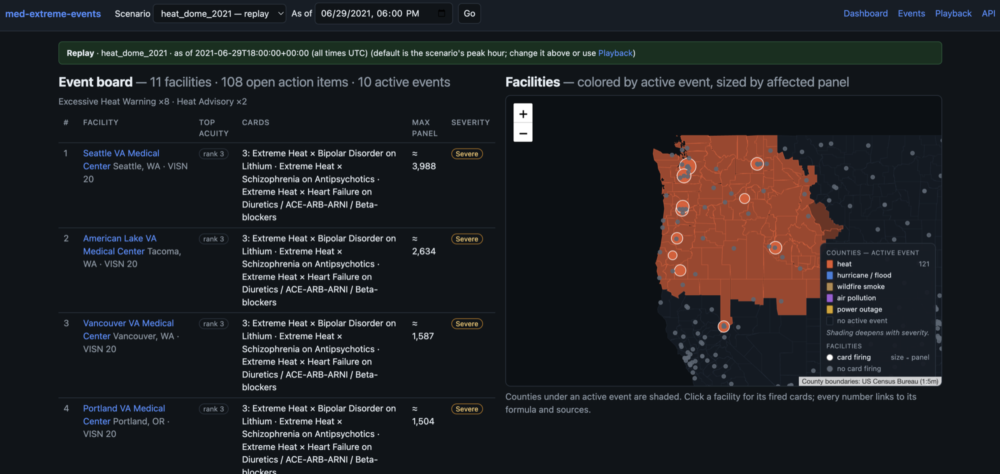

# Medical layer: facilities, panels, cards and action items

*Part of the [design and user guide](README.md). As of 2026-09-21.*

The medical layer answers: **given the events active now, which VA facilities have
patients at risk, roughly how many, and what should the care team and the patients do?**
It reads `Event` records from the event layer ([events-and-playback.md](events-and-playback.md))
and nothing else from it. It runs in **Mode A**: no patient records, real or synthetic.
Every patient count is an aggregate estimate that carries its formula and sources.

## 1. Pipeline

```
facilities.geojson ──► attribution (county, VISN) ──► catchments (county → station)
                                                              │
VetPop × PLACES × profile rates ──► PanelEstimator ◄──────────┘
                                          │
events ─► engine.match(events, cards, stations, profile, panels) ─► action_items ─► pages / API
                 ▲
     cards/*.yaml + profiles/va.yaml
```

| Stage | Command | Code |
| --- | --- | --- |
| Facility spine, county attribution, catchments | `make load` | `scripts/load_reference.py`, `geography/attribution.py`, `geography/catchment.py` |
| Match events to cards and write action items | `make match` | `scripts/match.py`, `engine.py`, `store.py` |
| Serve | `make serve` | `api.py`, `web/views.py` |

## 2. Facilities and catchments

**Facilities.** The 1,400 VA health facilities from the VA Lighthouse Facilities API are
cached in `fixtures/reference/facilities.geojson`. Each facility is attributed to a county
by point-in-polygon on its coordinates, with the ZIP crosswalk as fallback. `county_source`
records which method was used. VISN comes from the facility record. VA market is not
available (see [data-sources.md](data-sources.md)). One facility is unresolved: Manila VA
Clinic, in the Philippines, has no US county.

**Stations own panels, clinics do not.** Every US county is assigned to its nearest
*anchor station*, a VA Medical Center or Health Care Center (`catchment.anchor_classifications`
in the profile), by great-circle distance to the county's representative point. The result
is 183 stations, each with a catchment of counties. Clinics (CBOCs and others) are linked to
their station by health care system, or to the nearest station otherwise. They display their
station's panel.

**Action items are issued only at stations.** If every clinic in a catchment were issued
items too, the same estimated patients would be counted once per clinic. The first demo had
this bug, which inflated panels several-fold. `scripts/match.py` passes only panel-owning
stations to the engine.

## 3. Panel estimates

`PanelEstimator` (`src/xevents/denominators.py`) turns a station's catchment into an
`Estimate`, which holds a value, a formula, inputs, sources, caveats and component
estimates. The UI renders all of it under "how was this number computed?".

```
veterans_in_catchment = Σ VetPop(county, projection_year) over the catchment
condition_panel       = one of:
    VA-literature rate:  veterans × share_of_veterans[vha_users] × rate      (bipolar, schizophrenia, HF, diabetes)
    national count:      count × veterans_in_catchment / national_veterans   (dialysis)
    PLACES rate:         Σ veterans(county) × PLACES prevalence(county)       (COPD, asthma, CHD, …)
card_panel            = condition_panel × class share (profile panel_multipliers), else condition_panel as an upper bound
sub-panels            = condition_panel × sub-panel share, else upper bound   (Card 3: clozapine has a share; LAI and methadone do not)
```

All rates, shares and scopes come from `profiles/va.yaml`. On load, the estimator checks
national sanity anchors (veterans ±5 %, VHA heart-failure patients ±20 %).

**A card fires only where it implies at least one patient**
(`profile.min_panel_patients = 1.0`). The engine logs the skip together with the computed
panel.

## 4. Playbook cards

The eight cards in `cards/*.yaml` are the clinical content. Each is transcribed verbatim
from `docs/card-library.md` (Cards 1–6) or `docs/card-library-additions.md` (Cards 7, 8 and
the Card 6 electricity-dependent DME sub-panel), the reviewed sources of truth.

| # | Card id | Fires on | Panel basis | Acuity (1 = highest) |
| --- | --- | --- | --- | --- |
| 1 | `heat-lithium` | NWS Heat Advisory, Excessive/Extreme Heat Watch or Warning; HeatRisk ≥ orange | bipolar (VHA rate) | 4 |
| 2 | `heat-antipsychotics` | same heat products | schizophrenia (VHA rate) | 5 |
| 3 | `hurricane-delivery-interruption` | Hurricane, Tropical Storm or Storm Surge Watch/Warning; Flood Watch/Warning; Flash Flood Warning | schizophrenia, with clozapine, LAI and methadone sub-panels | 2 |
| 4 | `heat-heart-failure` | same heat products | heart failure × ACE/ARB/ARNI share | 6 |
| 5 | `outage-insulin` | Hurricane or Tropical Storm Watch/Warning; forecast power outage | diabetes (VHA rate) | 3 |
| 6 | `outage-dialysis` | same as Card 5 | dialysis (national count by veteran share) | 1 (highest) |

Acuity is the order in `profile.acuity_order`: dialysis, then clozapine/LAI/methadone,
insulin, lithium, antipsychotic heat, heart failure.

**Anatomy of a card.** A card has `event_triggers` (any one fires the card; all conditions
within a trigger must hold) and a `population_selector` (condition, medication-class and
device codes, the `denominator_key` and sub-panels). It has `actions` per role, where care
team actions are tagged `pre_event` or `during_event`. It also has `escalation` signs (a
null response means the profile's default "Contact your care team."), an `evidence_tier`
with per-claim tiers and source ids, `sources`, `window_days` (3–7), `safety`, and
`care_system_hooks` that point into the profile.

**What the loader rejects** (`src/xevents/cards.py`, enforced by tests): unknown fields, a
claim with no tier, a `weak` tier (the enum has no such value), unknown source ids, duplicate
ids or numbers, a medication card without `safety.do_not_stop_medication: true`, and
malformed YAML. `cards/card.schema.json` is generated from the models (`make schema`), and a
test fails if it drifts.

**To change clinical content,** edit `docs/card-library.md` through clinical review first,
then transcribe the change into the YAML and bump the card `version`. A test checks that the
patient-facing sentences in the YAML match the library.

## 5. The matching engine and action items

`engine.match()` is pure and deterministic. For each event, in onset order:

1. **Scope.** Take the stations whose county is in `event.geography.county_fips`.
2. **Trigger.** For each card, evaluate its triggers against the event. Every evaluation is
   logged with its reason (`matched`, or why not).
3. **Size.** Look up the card's panel at each station, and skip the station if the panel
   is below `min_panel_patients`.
4. **Issue.** Create one `ActionItem` per (event, card, station, role). Roles are
   `care_team` and `patient`, plus `caregiver` when the card has caregiver text (none do
   yet).
5. **Supersede.** Within (card, station, role, event type), when windows overlap, the
   stronger item wins and the weaker is marked `superseded_by` it. "Stronger" means higher
   CAP severity. A Warning therefore supersedes the Watch it follows.
6. **Rank.** Sort by acuity, then event severity, then panel size.

**An action item** copies the card content verbatim: actions for the role, the patient
message, escalation with the templated default response, and the safety line "Don't stop
your medication — contact your care team." It also carries the event, the card id and
version, the evidence tier, citations, the panel estimate and the acuity rank. Its window
runs from `onset − card.window_days.max` to `expires`, so it opens up to 7 days before the
event. Its id is its natural key, `event_key|card_id|facility_id|role`.

**Lifecycle.**

```
issued → delivered → acknowledged → completed
   └──────────┴────────────┴──────→ expired | superseded
```

`POST /action-items/{id}/status` enforces these transitions. In live mode, `make match`
expires items whose window has ended. Re-running `match` upserts by natural key: content
refreshes, while delivery and acknowledgement progress and `created_at` are kept. Replays
are rebuilt from scratch.

**Golden tests** pin the replay output exactly for all five scenarios: `heat_dome_2021`
(240 items, Cards 1, 2 and 4 across WA/OR/ID stations), `ian_2022` (2,104 items, most
superseded as hurricane-watch items yield to observed outages; dialysis ranked first),
`smoke_nyc_2023`, `uri_2021` and `smoke_canada_2026`. To regenerate them after an intended
change, run `UPDATE_GOLDEN=<scenario> make test` (or `UPDATE_GOLDEN=all`) and review the diff.

## 6. Using the care-team pages

*The complete, current description of the dashboard, facility page and patient view,
including the v2 additions (temporality → phase, the emPOWER line, the compounding chip,
outage attribution), is [user-interface.md](user-interface.md).*

> **Since 2026-09-22** the Dashboard, the facility page and Playback are one view,
> **Monitor** at `/` (live first, replays in the same menu; a facility or card opens in its
> focus layout), with **Scenarios** (`/replays`) and **Sources** (`/sources`) tabs beside it.
> `/playback` and `/dashboard/facilities/{id}` redirect there. The text and screenshots below
> describe the earlier pages; [user-interface.md](user-interface.md) is current.

The header of every page carries a **scenario switcher** (the five replays and
**live (now)**) and an **as of** time in UTC. A replay opens at its peak hour, the hour
with the most simultaneously active events.

**Dashboard (`/`).**



*The `heat_dome_2021` replay as of 2021-06-29 18:00Z. Eleven stations have open items from
10 active heat events. Each station fires Cards 1, 2 and 4, with its largest panel and
the event severity shown. On the map, heat-shaded counties and card-firing facilities are
sized by panel.*

- *Event board*: the facilities with active items, ranked by acuity, then severity × panel.
  Stations come before clinics on ties.
- *Outreach queue*: the count of still-`issued` items in the two highest acuity classes
  (dialysis and clozapine/LAI/methadone). These are the items someone must act on first.
- *Map*: facilities colored by active event and sized by panel, on the county basemap.
- *Live mode*: a feed-freshness banner. An empty board is never presented as an all-clear.

**Facility page (`/dashboard/facilities/{id}`).** Shows the fired cards (the strongest
event per role), the clinician checklist grouped *pre-event* / *during*, and the panel with
its expandable provenance. Each card shows its event id, card version, evidence tier and
citations. A role toggle switches between *care team* and *patient & caregiver*. The
**Acknowledge** and **Mark completed** buttons drive the status machine. A carbon panel is
also shown (see §7).

**Patient view (`/demo/patient-view?facility=&card=&role=`).** A read-only rendering of
what a patient or caregiver would receive: the verbatim card text, the safety line, the
escalation signs, and the disclaimer. It is a demo of the content. There are no patient
accounts.

**Playback overlay (`/playback`).** On the event map, the medical layer adds:

- facility circles, sized by panel;
- **card chips**, a small fanned stack above each facility with one colored chip per firing
  card. A card keeps its color everywhere;
- **Cards firing now** and **Facilities by acuity** in the side panel.

Clicking a card filters the map to where that card fires and opens the card itself: its
summary, acuity, evidence tier, window, role text, safety line, escalation signs, citations,
the facilities with their panels, and the carbon panel. Card text is fetched from `/cards`,
so no clinical wording is duplicated in JavaScript. For screenshots of the overlay and a
selected card, see [events-and-playback.md §5](events-and-playback.md#5-using-the-playback-view).

## 7. Carbon panel (display only)

`docs/carbon.yaml` holds order-of-magnitude life-cycle carbon estimates for the medications
on each card. `src/xevents/carbon.py` loads it, and `docs/carbon-footprint.md` describes the
methods. For each drug, the panel shows the assumed dose, ranges per dose and per
patient-year, a car-kilometre equivalent, the basis and confidence, and the range scaled to
the facility's panel. Drugs on one card are alternatives, so they are shown as separate
scenarios and never summed. The file's disclaimer travels with every rendering. **Carbon
never influences triggering, ranking or clinical text.**

## 8. API

| Endpoint | Returns |
| --- | --- |
| `GET /facilities[?state=&visn=&county=]` | GeoJSON of facilities with county and VISN |
| `GET /facilities/{id}` | One facility |
| `GET /facilities/{id}/panels[?card=]` | Veterans in catchment and each card's panel, with provenance |
| `GET /facilities/{id}/action-items?role=&at=` | A facility's items |
| `GET /action-items?scenario=&at=&facility=&role=&card=&status=&include_superseded=` | Compact item rows, for lists and maps |
| `GET /action-items/{id}` | One full item |
| `POST /action-items/{id}/status` | Status transition (`{"status": "acknowledged"}`) |
| `GET /cards` | The card library |
| `GET /carbon` | The carbon table |

Response shapes and the rules for rendering clinical text are in
`docs/card-reference-for-frontend.md`.

## 9. Open items for clinical review

These are tracked in `PROGRESS.md`:

- The VHA-user share (0.50 of veterans), which scales every VA-literature rate.
- Heat cards also fire on heat **watches**, the 3–7-day lead signal. The card library names
  only advisories and warnings.
- Claim-level evidence tiers, and the terminology bindings (ICD-10-CM, ATC), are engineering
  placeholders.
- Caregiver text is empty on all eight cards. It is content for a reviewer to write, not code.
- Notification channels (My HealtheVet, VEText, Clinical Contact Center) are named in the
  profile, but no adapters exist.
