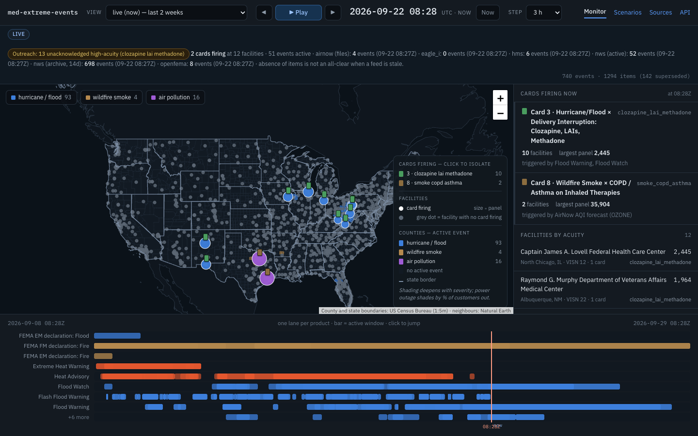
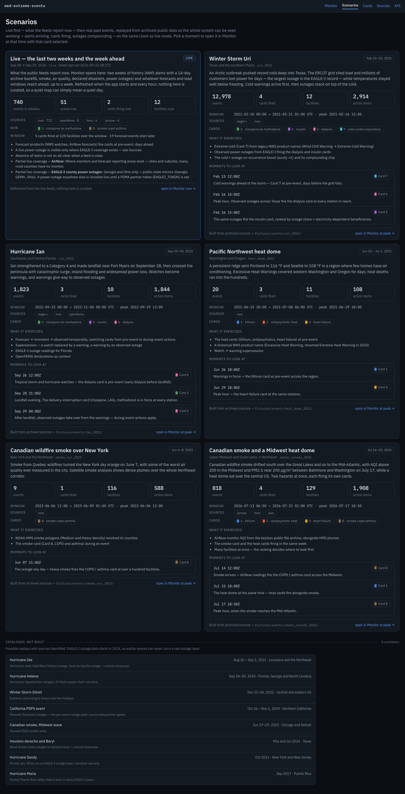
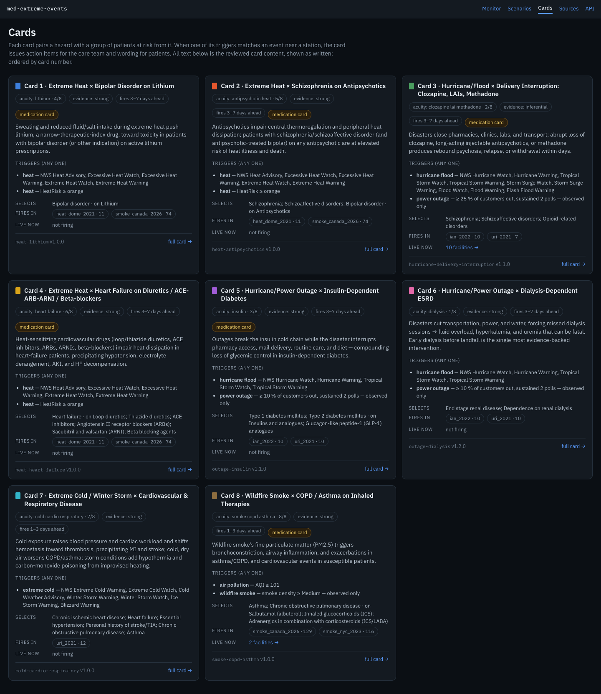
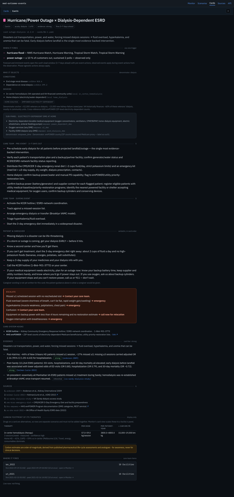

# User interface: how to use it and how it is meant to work

*Part of the [design and user guide](README.md). As of 2026-09-23, after iteration v2
(temporality, EAGLE-I outages, emPOWER, Cards 7–8). Public demo:
<https://med-extreme-events.onrender.com>.*

This is the single reference for the web interface. Each section says what a screen shows,
how to use it, and the rule behind what you see, so a demo presenter can explain it and a
developer can tell a bug from a design decision. The layer guides go deeper on the data:
[events-and-playback.md](events-and-playback.md) for feeds and events,
[medical-layer.md](medical-layer.md) for panels, cards and action items. Front-end rendering
rules for the card content are in [card-reference-for-frontend.md](../card-reference-for-frontend.md).

## 1. What the interface is for

The system turns public hazard feeds into **action items** for VA facilities: which stations
have patients at risk from an event, roughly how many, and what the care team and the
patients should do. The interface answers three questions:

1. **Where do we act first?** Monitor ranks facilities by acuity and size, at any moment.
2. **What exactly do we do at this station?** Selecting a card or facility gives the
   checklist, the patient wording and the numbers behind them.
3. **How did this unfold?** Monitor replays a scenario on the map, hour by hour.

Everything runs in **Mode A**: aggregate estimates, no patient records. An item is scoped to
a station, and its panel is an estimate with its formula attached.

## 2. Pages at a glance

The header has five tabs, **Monitor · Scenarios · Cards · Sources · API**, and an **About**
pill that reopens the welcome screen.

| Page | URL | Use it to |
| --- | --- | --- |
| **Monitor** | `/` | The main view (the tab always opens live, now): live now (the last two weeks, forecasts ahead) or a replay, on one clock — map, cards firing, facilities by acuity, outreach queue, timeline. Select a card or facility to read it. |
| **Scenarios** | `/replays` | Read what each replay is and exercises, with guided moments that open Monitor at that time and card |
| **Cards** | `/card-library` | Read the eight playbook cards: triggers, who they select, actions, patient wording, escalation, evidence, and where each fires. `/card-library/{id}` is one card in full. |
| **Sources** | `/sources` | See every data source, what it drives, where it covers live, and its last run |
| API | `/docs` | The JSON API behind every page (interactive OpenAPI) |
| **About** | `/about`, or the About pill | What this is and how to use it. It opens by itself on a first visit; `?about=1` on any page opens it, `?tour=1` starts a four-step guided tour of Monitor on the Uri replay |
| Patient view | `/demo/patient-view?facility=&card=` | The light, printable card a patient or caregiver would receive |
| Events table | `/dashboard/events` | Every event in the view, active or whole window (linked from Monitor's rail) |
| Event page | `/dashboard/events/{event_key}` | One event: its counties, fields, metrics and the items it produced |

Old addresses still work: `/playback` and `/dashboard/facilities/{id}` redirect into Monitor
with the same scenario and time (and the facility selected).

## 3. Controls every page shares

- **All times are UTC**, everywhere.
- **The banner** under the header says which mode you are in.
  - *Replay*: the scenario, its window and what is firing at the current time.
  - *Live*: every provider's last run — events it produced, **failed**, or *off* — with
    its time, marked **(stale)** when the last good run is more than six hours old; hover a
    provider for its detail. The banner turns amber when any provider failed or went stale,
    and always adds "absence of items is not an all-clear when a feed is stale": an empty
    view then means "we don't know", not "nothing is happening".
- **Monitor's URL holds the whole view** — `?scenario=&at=&card=&facility=&event=` — so a
  reload, the browser's Back button and a shared link all reopen the same moment and
  selection. Live at "now" leaves the time out, so a reload opens on the new now.
- The events table, event page and patient view keep a **View / As of** form in the header
  for picking a scenario and time directly. Scenarios and Sources have none.

## 4. Monitor (`/`)

*Monitor in live mode, 2026-09-22 08:28Z. Flood products fire Card 3 and AirNow ozone
forecasts fire Card 8; the outreach chip counts 13 unacknowledged high-acuity items. The
timeline runs from two weeks back to a week ahead, with a dashed "now" marker.*

*Browse layout, Uri at 2021-02-16 15:00Z (peak hour). Active hazards as pills top-left, the
legend bottom-right, the rail on the right, and the timeline with its playhead.*

*Card focus: Card 6 (dialysis) is the reading column; the map is a 190px inset scoped to the
card's counties; the rail lists where it fires (bars ∝ panel) and what triggered it.*

**How to use it.**

| Control | Effect |
| --- | --- |
| **View** | Pick a replay, or **live (now) — last 2 weeks** (the default) |
| Click the **clock** | Type a date and time (UTC); Enter applies, Esc cancels |
| **Now** (live only) | Jump back to the current time |
| **Outreach** chip in the banner | Show only facilities with unacknowledged high-acuity items; click again for all |
| ▶ Play / Pause, or **Space** | Advance the clock one step per tick |
| ◀ ▶, or **← →** | Pause and step back or forward |
| **Step** | Step size: 1 h, 3 h (default), 6 h, 12 h, 1 day |
| Click or drag the timeline | Jump to that moment |
| Click an event bar or an event in the rail | Select that event (stays in browse) |
| Click a card in the rail or the legend | Open the card focus layout |
| Click a facility in the focus rail | Show the card for that facility (nested) |
| Click a facility dot or a facility in the browse rail | Open the facility in focus |
| **×**, **Escape**, the breadcrumb, or **expand map ⤢** | Step out one level (expand map returns to browse) |

**How it is meant to work.**

- **Two layouts on one clock.** The layout is derived from the selection, never a separate
  mode: nothing selected → **browse** (big map, rail, timeline); a card or facility selected
  → **focus** (the card in a reading column, the map demoted to an inset fitted to the
  selection's counties). The swap is instant and the map is resized after it.
- **Live first.** Monitor opens on live *now*. The live timeline runs from two weeks back to
  the furthest forecast or lead window ahead (at most a week), with a dashed **now** marker.
  A replay opens at its **peak hour**, the hour with the most simultaneously active events.
- **Header.** View, transport, the clock (19px, with *UTC · peak hour* or *UTC · now*), and
  step. The banner under it says replay or live; live keeps the per-feed
  freshness and "absence of items is not an all-clear when a feed is stale".
- **County shading.** Each county takes the colour of its most severe active event type.
  Opacity deepens with CAP severity; power-outage counties deepen with the percent of
  customers out instead (10 % faint, 60 % and above solid). State borders sit above.
- **Facilities and card chips.** Circles are sized by panel. Above each station, a fanned
  stack of chips shows the cards firing there, one colour per card, the same colour on every
  screen. Hover names every card.
- **Timeline.** One lane per product over the scenario window, labels in a fixed 168px
  column, bars dimmer for weaker severities, and a playhead through every lane at *t*. More
  than nine lanes collapse into "+N more".
- **Browse rail**, at *t*: **Cards firing now** (facilities, largest panel, "triggered by"),
  **Facilities by acuity**, **Events now** (with a link to the full events table). A
  selected event shows above them.
- **Ranking.** Facilities by acuity are ordered by their most urgent item: first the acuity
  class (dialysis, then clozapine/LAI/methadone, insulin, lithium, antipsychotics in heat,
  heart failure, cold, smoke; defined in `profiles/va.yaml`), then event severity × rank
  score, then stations before clinics. The rank score is the panel size, except for power
  outages, where it is *percent of customers out × electricity-dependent Medicare
  beneficiaries*. **Cards are issued only at stations** (VAMCs and health care centers that
  own a catchment), so the same estimated patients are never counted twice at every clinic.
- **Outreach queue.** The banner chip counts care-team items still *issued* in the two
  highest acuity classes at *t*, naming the classes. Acknowledging an item in the card block
  lowers the count immediately.
- **Card focus.** The reading column is the card block (§5), fetched from the
  server for (facility, card, *t*, audience) — for the facility with the largest panel unless
  you pick one — so no clinical wording lives in the JavaScript. It is refetched only when
  the items active at *t* change.
- **Phone (under 900px).** One column: header, banner, a thin timeline strip (one row per
  hazard colour), the map at 38vh, then the rail. Focus stacks breadcrumb, a 140px inset, the
  card and the rail. Controls are at least 44px tall.

- **Neighbours.** Canada, Mexico, Cuba and the Bahamas are drawn as muted land (Natural
  Earth), so the US is not an island; no events are drawn outside the US.

*The July 2026 smoke replay at its peak hour. Smoke (tan) and AirNow AQI (purple) cover the
Midwest and Northeast while the heat dome (red) fires the heat cards; Canada and Mexico are
drawn as muted land. Card 8's trigger summary reads "AirNow AQI (PM2.5), HMS smoke (Heavy),
HMS smoke (Medium)".*

## 5. The card block (Monitor's focus layout)

*Houston VAMC selected in the Uri replay at 2021-02-16 15:00Z: every card firing there, in
the reading column; the rail lists the cards here and the events that triggered them.*

Selecting a card or a facility in Monitor shows its card blocks in the reading column. The
block is one server-rendered partial (`cards_partial.html`, also served at
`/dashboard/facilities/{id}/cards`), so its clinical text never passes through JavaScript.
The old facility page redirects here.

**How to use it.** Toggle **care team** / **patient & caregiver** inside a card to switch
between the clinician checklist and the light patient card that the veteran receives. Expand **how was this number computed?** under
any number to see its formula, inputs, caveats and sources. Use **Acknowledge**, then **Mark
completed**, to record progress. **open patient view ↗** shows the patient-facing rendering.

**How it is meant to work.** One block per card that fires at this station at the as-of
time. When several events fire the same card, the block shows the strongest event's item.
Each block has, top to bottom:

1. **Title and tags**: the card, its acuity class, and the triggering event with its CAP
   severity.
2. **Provenance line**: event key, the item's window, card id and version, evidence tier,
   and **temporality → phase**. The temporality of the event decides which actions apply:
   *forecast* and *imminent* events show **pre-event** actions, *observed* events show
   **during-event** actions. Phase-agnostic actions always show. The window of an observed
   event's item starts at the observation (it has no lead time); a forecast or imminent
   event's item opens the card's lead window, days ahead. So in a replay each outage reading
   is current from its own time up to, not including, the next reading.
3. **Outage attribution** (outage cards only): "Electric customer outage data provided by
   EAGLE-I, Department of Energy" and "customers are meters, not people".
4. **Compounding chip** (heat and cold cards only, when it applies): **compounding · acuity
   +1**, followed by the first three outage events it co-occurs with and a count of the rest. It means an observed power outage
   in the same county, above a card threshold and sustained for two polls, overlaps this
   event. The item was moved up one acuity class. Outage items show the chip too, as an
   annotation without the bump.
5. **Affected panel ≈ N veterans**: the condition-based estimate. Its popover walks the
   arithmetic: veterans in the catchment × the rate from the profile, with each sub-panel
   and its caveat. A multi-condition card (Card 7) reports its largest single-condition
   panel and says it is a lower bound. Sub-panels without a reviewed denominator are listed
   as *not sized*, never filled with a borrowed number.
6. **N electricity-dependent Medicare beneficiaries in catchment** (outage cards only):
   the HHS emPOWER count, always labelled *measured; Medicare proxy — not veteran-specific*.
   It sits next to the veteran panel and never replaces it. Its popover shows the ranking
   formula.
7. **Actions**, both phases from the card. The phase that applies at the as-of time (and
   any phase-agnostic actions) is at full strength with **applies now**; the other phase is
   dimmed and marked **reference**. The text is copied verbatim from the reviewed card.
8. **Safety line**, for any card that selects on medication: "Don't stop your medication —
   contact your care team." It is never collapsed.
9. **Escalate** block, always open, with each response in bold; then **sources**, the
   **carbon panel** (display-only estimates of
   the card's therapies, with their disclaimer; never used for triggering or ranking).
10. **Status**: `issued` → `acknowledged` → `completed`. An item replaced by a stronger
    event becomes `superseded` and disappears from the default views. If that stronger
    event goes away, the item comes back with the progress it had.

## 6. Patient view (`/demo/patient-view`)

A light, print-ready card (black on white, one card per page when printed; **Print** and
**Copy text** beside it). `&view=pair` sets the care-team block beside each patient card so a
reviewer sees both renderings of the same item. The headline is the card title: the design
mock's plain-language headline is not reviewed content, so it is not used.

A read-only rendering of what a patient or caregiver would receive for one card at one
facility: the verbatim patient sentences, any caregiver note, the safety line, and the
escalation signs, with emergencies spelled out as "this is an emergency (911)". The footer
says it is decision support for contacting the care team, not a diagnosis. It is a content
demo; there are no patient accounts and nothing is sent.

## 7. Events and the event page

**Events (`/dashboard/events`)** lists every event in the view. The default shows those
active at the as-of time; **Show every event in the window** lists them all. Each row has the
product, where, **severity**, a **temporality badge** (forecast / imminent / observed),
urgency, onset and expiry, and county and facility counts.

**Event page (`/dashboard/events/{key}`)** shows one event: its counties on a map (shading
by severity, or by percent out for outages), its geography notes, all metrics, the raw
payload path, and the facilities whose items it produced. An EAGLE-I outage event also shows
*customers out of county customers (percent)*, how many polls it has been sustained, a
popover with the formula and caveats, the attribution, and a **data-quality flag** when the
feed reported more customers out than the county has (the percent is capped at 100 and the
raw value kept).

## 8. Scenarios (`/replays`)

**How to use it.** The **Live** card comes first: what the feeds hold right now — events in
Monitor's window (two weeks back, up to a week ahead) by source, how many are active now,
the cards firing now (click one to open it live in Monitor), what fired over the window,
forecast events still ahead, when the feeds last ran, and every source whose live coverage
is partial (EAGLE-I: Georgia and Ohio only). Then each built replay has a card: what happened, what it exercises (the code
paths it shows, such as the cold × outage boost), its window, sources and the cards it fires,
and **moments to look at**. Click a moment to open Monitor at that time with that card
selected; **open in Monitor at peak →** opens the busiest hour. Below them, **Cataloged, not
built** lists feasible replays whose sources are identified.

**How it is meant to work.** The live card's numbers are computed on every request from the
live rows and the run log; with no live data it says "no live events ingested yet" instead of
showing zeros. The stories and moments live in `data/scenarios.yaml`; the
numbers (events, cards fired, facilities, action items, window, peak) are computed from the
fixtures and stored items. A test runs every replay and checks that each moment's card
really fires at that time, so a moment cannot quietly point at nothing.

## 8a. Cards (`/card-library`)

**How to use it.** The overview shows all eight cards in number order: title, acuity class
(and its place in the acuity order), evidence tier, lead window, the triggers (any one fires
the card), who it selects, **Fires in** — one chip per replay with the number of facilities,
opening Monitor at the card's busiest hour — and **Live now**. **full card →** opens the
card's page.

The card page has, in order: when it fires (triggers with their thresholds, and the
temporality → phase rule); who it selects (condition, medication and device codes, flags,
the denominator and its note, sub-panels); the care-team actions by phase; the patient
sentences and caregiver wording; the safety line and the escalation block (a null response
shows the profile's templated default, as items do); care-system hooks; the evidence
(mechanism, each claim with its tier and sources); the numbered sources; the carbon rows
(unscaled — Monitor's card view scales them to a facility's panel); and where it fires.

**How it is meant to work.** Everything is read from `cards/*.yaml` and `profiles/va.yaml`
and shown verbatim — a test checks that every action, patient sentence, escalation sign,
claim and source of every card appears on its page. The safety line comes from the same
function the engine uses (`engine.safety_message`). "Where it fires" is computed from the
stored action items (care-team role, superseded items excluded, as Monitor shows them).

## 8b. Data sources (`/sources`)

**How to use it.** Read the amber call-outs at the top first: they name every source whose
live coverage is partial (today **EAGLE-I: Georgia and Ohio only**, and AirNow: only where
monitors exist) and any feed that failed or went stale. Each card below then says what the
source provides, which cards it drives, its live coverage, which replays carry it (click a
chip to open that replay in Monitor), access, cadence and limits. **details ↗** opens the
source's section of the data-sources guide.

**How it is meant to work.** The descriptions come from `data/sources.yaml`; everything that
changes is read at request time: each live feed's last run from the run log (the same one
the live banner uses), the replay chips from the fixtures, and the VA facility counts
(facilities, stations, VISNs, states) from the database. The **Not yet connected** list is
the `backlog` rows of `data/hazard_sources.yaml`, so the backlog lives in one place.

## 9. Visual language

| Element | Meaning |
| --- | --- |
| County colours | Heat red · extreme cold / winter storm cyan · hurricane / flood blue · wildfire smoke tan · air pollution purple · power outage amber · no event dark |
| County opacity | CAP severity (Minor faint → Extreme strong); outages by percent out |
| Light outline | State border |
| Card colours | 1 blue · 2 red · 3 green · 4 amber · 5 purple · 6 pink · 7 cyan · 8 brown (`--card-N` in `static/app.css`) |
| White-ringed circle | Facility with a card firing, sized by panel |
| Grey dot | Facility with nothing firing |
| Severity tag | CAP severity of the triggering event |
| Temporality badge | **forecast** blue · **imminent** amber · **observed** red-orange |
| Compounding chip | Co-occurring outage; "acuity +1" on heat and cold items |
| `superseded` | Replaced by a stronger or newer event; hidden by default |

Every tag carries text as well as colour. The card chips on the Monitor map are colour-only;
the legend and the hover text name them.

Tokens, type (self-hosted IBM Plex Sans and Mono) and every shared component live in one
stylesheet, `src/xevents/web/static/app.css`.

## 10. Live and replay

- **Replay** scenarios are computed ahead of time from archived sources and never change.
- **Live** events are pulled from the feeds when the app starts and then hourly, when
  `LIVE_REFRESH_MINUTES` is set (it is in `.env.example`, the image and Render): NWS alerts
  plus a two-week archive backfill, OpenFEMA declarations, NOAA smoke, AirNow hourly monitor
  AQI and next-day forecasts (keyless public files), and EAGLE-I county outages for
  **Georgia and Ohio only** (the public state mirrors; national coverage needs a FEMA token).
  An AirNow forecast of "Unhealthy for Sensitive Groups" or worse fires Card 8 with
  **pre-event** actions. Live data is rebuilt from the feeds after each restart or redeploy;
  the first refresh lands within seconds locally and within about three minutes on Render's
  free tier (a fraction of a CPU); until then the live board is empty. Replay pages do not
  wait: their responses are computed when the image is built and loaded at startup. After a
  restart an outage needs two consecutive hourly readings over the threshold before Cards 3,
  5 and 6 fire.
- A live board fills with the items of alerts active now. Items whose window has passed are
  expired automatically; replay items never expire.

## 11. Principles the interface keeps

1. **Clinical text is shown verbatim.** Actions, patient sentences and escalation signs are
   reviewed content from the card files; the interface never paraphrases or truncates them.
2. **Every number has its provenance** one click away: formula, inputs, caveats, sources.
3. **The safety line always shows** under medication cards.
4. **Measured proxies are labelled.** emPOWER counts are Medicare beneficiaries, not
   veterans, and say so. EAGLE-I counts are meters, not people, and carry the DOE attribution
   wherever they render, including the map legend.
5. **No external assets.** Maps are drawn from the app's own county and state boundaries,
   with the neighbouring countries as a muted backdrop; the interface works offline and
   needs no map key.
6. **No patient data.** Items are per station; panels are estimates.

## 12. Known issues

- **Replay supersession is time-independent.** Statuses are computed once over the whole
  scenario, so before a warning is issued its watch can already appear superseded.
- **Live outage coverage is Georgia and Ohio only**, from unofficial public mirrors of
  EAGLE-I; everywhere else a live power outage is invisible until a FEMA token is set.
- **Status buttons have no login.** Anyone on the public demo can acknowledge or complete an
  item; changes reset on every redeploy.
- **Card chips are colour-only** on the Monitor map (the legend and hover text name them).
