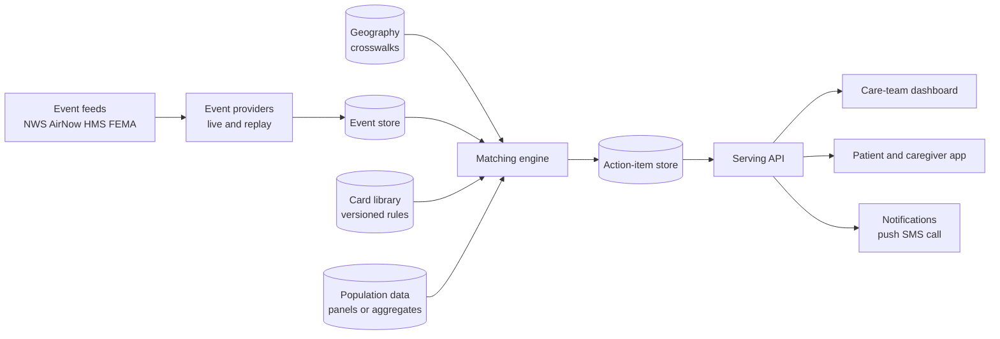

# Extreme-Event Care Decision Support — Requirements v1

*As of 2026-09-20*

Requirements for a generic system that maps forecast extreme events (heat, hurricane/flood, wildfire smoke, air pollution, power outage) onto an affected care population and produces actionable playbook-card guidance for clinicians, patients, and caregivers — designed population-agnostic (pediatric, geriatric, chronic-disease), specialized first for VA. Derived from a critical review of Card Library v1 (see `docs/card-library.md`).

## 1. Critical Review of Card Library v1

The card library is a strong knowledge base but not yet a system: it encodes what to do, not when, for whom exactly, or through what channel. The gaps below are the requirements drivers.

| # | Gap in v1 | Requirement it drives |
| --- | --- | --- |
| G1 | Cards are prose, not machine-readable | Cards become structured rules (condition codes, med classes as RxNorm/ATC, event triggers as thresholds) — §7 |
| G2 | Population sized by aggregate multipliers only | Data model must accept real panel data (FHIR) when available, degrade to aggregate estimates when not — §3 |
| G3 | No schedule awareness — "LAI due soon," "dialysis session" are undated | Ingest procedure/appointment schedules; compute event × schedule collisions — §3 |
| G4 | VA-specific throughout (VHA prevalence, VA pharmacy plan) | Split generic core from population profiles; VA is profile #1 — §2 |
| G5 | Trigger definitions informal ("HeatRisk orange+") | Formal event taxonomy with per-card, per-population thresholds — §4 |
| G6 | Single implicit location per patient (facility county) | Multi-location model with declared precision tiers — §5 |
| G7 | One audience voice per card (clinician + one patient paragraph) | Role-targeted outputs: clinician, patient, caregiver — caregiver is primary for pediatric and much of geriatric — §6 |
| G8 | No delivery mechanism — cards live in a document | Action items persisted in a store, served by API, pushed to web/app with status tracking — §7 |
| G9 | Evidence tiers noted but not enforced | Every generated action carries its evidence tier and source; weak claims blocked at authoring time — §8 |
| G10 | No lifecycle — what happens when the event passes or a patient acts | Action-item state machine (issued → acknowledged → done/expired) — §7 |

What v1 got right and the system must preserve: the (event × condition × med/device class) card as the atomic unit; the 3–7-day actionability window; "don't stop the medication" as a hard-coded safety message; explicit evidence-tier labeling; no-PHI aggregate mode as a first-class operating mode, not a stopgap.

## 2. System Concept

The system is a generic event-to-care matching engine: forecast extreme events are joined to a care population's conditions, medications, devices, and schedules, producing role-targeted action items 3–7 days ahead of the event. Everything population-specific lives in a swappable **population profile**; the engine, card schema, event feeds, and delivery layer are shared.

**Actors.**
- Care-team user (clinician, pharmacist, care coordinator): panel-level view, ranked outreach lists.
- Patient: their own action items, plain language.
- Caregiver (proxy): the same items on the patient's behalf — the primary user for pediatric, and frequently for geriatric and SMI populations. Proxy access is a first-class account relationship, not a shared login.
- System administrator / card author: maintains the card library and thresholds.

**Operating modes** (a deployment declares one; the engine is identical):
- Mode A — aggregate/no-PHI: panels sized from public prevalence × enrollment (the current demo).
- Mode B — panel-connected: real rosters via EHR/FHIR; per-patient matching, still clinician-facing.
- Mode C — patient-connected: patient/caregiver app with consented individual data.

**Population profiles** — what a profile must define:

| Profile element | VA (first implementation) | Geriatric (e.g., Medicare/LTC) | Pediatric |
| --- | --- | --- | --- |
| Condition mix priorities | CHF, COPD, diabetes, CKD, SMI, PTSD/OUD | Same + dementia, polypharmacy, frailty | Asthma dominant; T1 diabetes; epilepsy; medically complex children |
| Med/device emphasis | Lithium, clozapine, methadone, insulin, dialysis | Anticholinergic burden, diuretics, home O2 | Inhalers/spacers, insulin pumps, seizure meds, enteral feeding |
| Primary app user | Patient (caregiver optional) | Mixed patient/caregiver | Caregiver (parent/guardian); school as secondary location |
| Denominator source | VetPop + PLACES + VHA literature | CMS chronic-conditions county data | PLACES (limited <18) + state asthma registries |
| Care-system hooks | VA Pharmacy Disaster Relief, NCCC, My HealtheVet | Part D pharmacies, LTC facility EOPs | School health plans (504), pediatric pharmacies |

The engine never hard-codes a profile fact: prevalence tables, med-class lists, message templates, and system hooks are all profile data.

## 3. Patient / Panel Data Requirements

Minimum data to match a person (or panel) to cards, in priority order:

| Data element | Why needed | Standard representation | Mode A fallback |
| --- | --- | --- | --- |
| Conditions / problem list | Card condition match | FHIR Condition (SNOMED CT; ICD-10-CM for claims-derived) | Prevalence × enrollment estimate |
| Medication list | Med-class flags (lithium, diuretics, insulin…) | FHIR MedicationRequest/Statement, RxNorm codes; classes via ATC or VA Drug Class (VA NDF-RT) | Med-class prevalence within condition (literature/MIMIC-derived multipliers) |
| Procedure / treatment schedule | Event × schedule collisions: dialysis sessions, LAI injection due dates, infusions, methadone dispensing | FHIR Appointment, ServiceRequest, CarePlan; recurring patterns | Facility-level schedule density (sessions/week) |
| Devices | Power dependence: home O2, CPAP, pumps, enteral feeding | FHIR Device / DME claims (emPOWER categories) | emPOWER ZIP counts |
| Location(s) | Event exposure join | See §5 | Facility catchment |
| Age band, housing status, isolation flags | Risk amplifiers (v1 evidence) | FHIR Patient + social-history observations (Gravity/SDOH codes) | PLACES social measures |
| Caregiver relationship | Delivery routing | FHIR RelatedPerson + consent | n/a |

**Standard systems to start from rather than invent:**
- **FHIR R4 / US Core** is the canonical patient-data interface — VA already exposes it (Lighthouse Veterans Health API, patient-consented OAuth via SMART on FHIR), so Mode C needs no custom EHR integration.
- **CDS Hooks** for clinician-facing triggers inside the EHR (a `patient-view` or scheduled hook returning card-derived suggestions) — the standard way to surface guidance in workflow rather than a separate portal.
- **Calendars:** treatment schedules should export as **iCalendar (ICS)** feeds per patient/caregiver ("dialysis Tue/Thu/Sat 7am", "LAI due Oct 3") so events land in the calendars people already use (Google/Apple/Outlook via CalDAV/ICS subscription). There is no widely adopted "medical calendar" standard beyond FHIR Appointment → ICS is the pragmatic bridge; medication schedules can additionally use FHIR MedicationRequest timing and, for reminders, the app's own scheduler.
- **Event alerts:** CAP (Common Alerting Protocol) is the alert interchange standard NWS already emits — adopt its severity/urgency/certainty vocabulary for our internal event records rather than inventing one.

**Explicitly out of scope for the demo, required for production:** consent management, 42 CFR Part 2 handling for SUD data (methadone), guardianship verification for pediatric proxies.

## 4. Extreme-Event Data Sources

All feeds are free/public; verified in the September 2026 feasibility review. Every event record is normalized to: event type, CAP severity/urgency/certainty, geography key(s), start/end window, source, raw payload.

| Event type | Primary source | Geography key | Cadence / horizon | Auth |
| --- | --- | --- | --- | --- |
| Heat (advisory/warning) | NWS api.weather.gov /alerts/active | NWS zone + county (UGC/FIPS) | Poll ≤30 s recommended; watches ~days out | None (User-Agent header) |
| Heat (sub-advisory risk) | NWS HeatRisk (experimental) | Gridded raster (GeoTIFF/ImageServer) | Daily, 7-day horizon | None |
| Hurricane / tropical / flood | NWS alerts (tropical products) + OpenFEMA DisasterDeclarationsSummaries | Zone/county; FEMA designated counties | Watches ~48 h; declarations post-hoc context | None |
| Air pollution (AQI) | AirNow API — new consolidated endpoints (legacy retire Sep 30, 2026) | ZIP or lat/lon | Hourly obs, daily forecast; 500 req/h limit | Free API key |
| Wildfire smoke | NOAA HMS smoke polygons | Polygon (shapefile/KML/WFS) | Daily, finalized next morning | None |
| Power outage (context) | OpenFEMA + utility feeds (profile-specific, best-effort); emPOWER hazard layers | County/ZIP | Varies | None |

**Requirements.**
- `EventProvider` interface with `live` and `replay` modes; replay scenarios are versioned fixtures — 2021 PNW heat dome, Hurricane Ian 2022, June 2023 Canadian-smoke NYC — doubling as tests.
- Per-card, per-profile trigger thresholds live in the card definition, not code (e.g., heat cards fire on Heat Advisory OR HeatRisk ≥ orange; pediatric asthma may fire at a lower AQI than adult COPD).
- Every trigger evaluation is logged with the source event id for auditability.
- Feed-health monitoring: a stale feed must degrade visibly (banner: "AQI last updated …"), never silently.

## 5. Location Model

Use the coarsest precision that still resolves the event — finer location buys little accuracy and costs privacy.

| Tier | Precision | Resolves | Use |
| --- | --- | --- | --- |
| L1 | County / NWS zone (FIPS/UGC) | NWS alerts, FEMA declarations | Default for all alert matching |
| L2 | ZIP/ZCTA | AirNow AQI, emPOWER counts, PLACES rates | Air-quality cards; denominator joins |
| L3 | Point (lat/lon) | HeatRisk raster, HMS smoke polygons, facility siting | Facility locations always; patient points only with consent in Mode C |

**Rules.**
- Patient default = ZIP (L2), derived county (L1) computed from it via crosswalk (note: ZIP→county is many-to-many; use HUD USPS ZIP-county crosswalk, assign by dominant share).
- A person has multiple locations, each tagged with a role and applicable days/hours: home, work, school/daycare (pediatric — the caregiver registers it), long-term-care facility (geriatric), dialysis center, and "temporary" (travel). Matching evaluates every active location — a child safe at home but attending school in a smoke plume must still trigger the asthma card.
- Homeless/unstably-housed patients (a v1 risk amplifier): location = facility catchment + shelter ZIPs where known; never require an address to receive alerts.
- Precision is a consent setting the patient/caregiver controls; the system must function at L1-only.
- Facilities always carry L3 from the facility registry (VA Facilities API GeoJSON) plus their county/VISN/market crosswalk for catchment attribution.

**Privacy trade-off, stated:** L1/L2 are effectively non-identifying in aggregate mode; L3 patient points are PHI-adjacent and exist only in Mode C under consent. Event matching accuracy loss from ZIP vs point is negligible for county-scoped alerts and modest for smoke polygons (ZIP centroid vs plume edge).

## 6. Users & Delivery

One matching result, three renderings — the card template already separates them (operational actions vs patient-facing language vs escalation triggers).

**Care-team dashboard (web).**
- Event board: active/forecast events × facilities, ranked by (event severity × affected-panel size).
- Per-event drill-down: fired cards, sized sub-panels, ranked outreach list (Mode B), action checklists with assignment and completion status.
- Export: outreach call lists (CSV), pre-drafted patient messages.

**Patient / caregiver app (web/mobile).**
- Timeline of upcoming events at the person's registered locations, each with its card's patient-facing guidance, "do now" checklist, and escalation triggers with one-tap call.
- Caregiver mode: same content addressed to the caregiver ("Ask her program about take-home doses"), multi-patient (a parent with two children; an adult child managing both parents).
- Calendar subscription (ICS): treatment schedule + event windows merged, so "get dialysis early Wednesday" appears next to the Thursday storm.
- Medication-list entry: manual entry or FHIR import (Mode C); the app never requires an EHR connection to be useful.

**Notification channels**, in escalation order: in-app → push → SMS → automated call for highest-acuity unacknowledged items (dialysis, clozapine). Profile hooks map to existing channels — VA: My HealtheVet secure message, VEText, Clinical Contact Center; pediatric: caregiver SMS + school-nurse email where authorized.

**Acknowledgment loop:** every pushed item is acknowledgeable; unacknowledged high-acuity items surface back on the care-team dashboard as an outreach queue — this closes the loop v1 lacked.

## 7. Conceptual Architecture

The matching engine runs on every event-store change and on a daily schedule; it is pure and replayable — same inputs, same action items.

**Stores.**
- Event store: normalized events (CAP-derived), append-only, keyed by source event id — the audit trail.
- Geography: county/zone/ZIP crosswalks, facility registry with catchments, population-profile denominators. Slowly changing; versioned reference data.
- Card library: cards as versioned structured definitions (YAML/JSON — trigger, population selector, actions per role, evidence tier + sources per claim). Authoring is a pull-request-style review, not a UI free-text edit.
- Action-item store: the system's core output. One row per (event, card, scope, role), where scope = facility (Mode A) or patient (Mode B/C).

**Action-item schema (conceptual).** `id, event_id, card_id+version, scope_type, scope_id, role (care_team|patient|caregiver), actions[], message, escalation[], evidence_tier, window_start/end, status (issued → delivered → acknowledged → completed | expired | superseded), created_at, acknowledged_at`. Status transitions are the state machine driving the outreach queue; items auto-expire at window_end; a strengthened alert supersedes rather than duplicates.

**Serving.** Read API (REST/JSON) for dashboard and app: `GET /facilities/{id}/action-items`, `GET /patients/me/action-items`, `GET /events/active?county=`. Push: webhook/queue per channel adapter. Relational database (PostgreSQL + PostGIS for the geography layer) is sufficient at any plausible scale; no exotic infrastructure is warranted at this stage.

## 8. Safety, Non-Functional Requirements & VA Specialization

**Clinical-safety guardrails (hard requirements).**
- The system never advises dose changes or stopping a medication; "don't stop your medication — contact your care team" is templated into every med-related patient message.
- Every action item carries its evidence tier (strong / inferential / expert-guidance) and source citations; cards citing only weak evidence cannot be published.
- Patient-facing content is decision support for contacting care, not diagnosis or treatment; disclaimers per role.
- Fail-safe direction: a broken feed or empty match produces no false "all clear" — absence of alerts is labeled with data freshness.

**Non-functional.** No PHI in Mode A anywhere in the stack; Mode B/C isolate identified data behind the population-data interface. Card and threshold changes are versioned and auditable. Replay determinism (§4) is a test requirement. Currency checks are scheduled tasks, not tribal knowledge: AirNow endpoint migration (post–Sep 2026), CDC guidance re-verification, clozapine REMS status, HeatRisk operational promotion.

**VA first-implementation bindings** (all verified public):
- Facility registry: VA Lighthouse Facilities API v0 (GeoJSON, free key) incl. `operating_status` as a display element.
- Catchment: data.va.gov VISN/Market/County crosswalk (9hbf-9jzg) + `/nearby` drive-time.
- Denominators: VetPop county counts × CDC PLACES rates × VHA literature multipliers (CHF ~5%, diabetes ~25%, schizophrenia ~3.6%, bipolar ~3.0%, >52k on dialysis).
- Care-system hooks: VA Pharmacy Disaster Relief Plan (10-day retail refills), NCCC clozapine registry, OTP coordination per SAMHSA, My HealtheVet / VEText / Clinical Contact Center channels.
- Card set: Library v1's six cards, restated as structured definitions — the first content of the card store.

**Open questions.**
- [ ] Does the demo's patient/caregiver app simulate Mode C with synthetic patients, or ship Mode A only?
- [ ] Which two replay scenarios headline the demo? *(Resolved: both — heat dome + Ian.)*
- [ ] Is CDS Hooks in scope for the demo, or documented as the Mode B integration path only?
